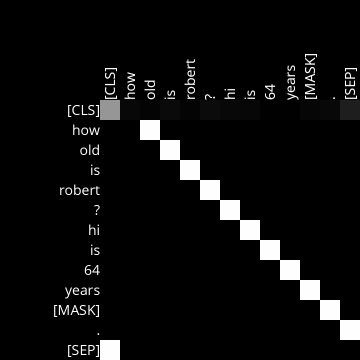
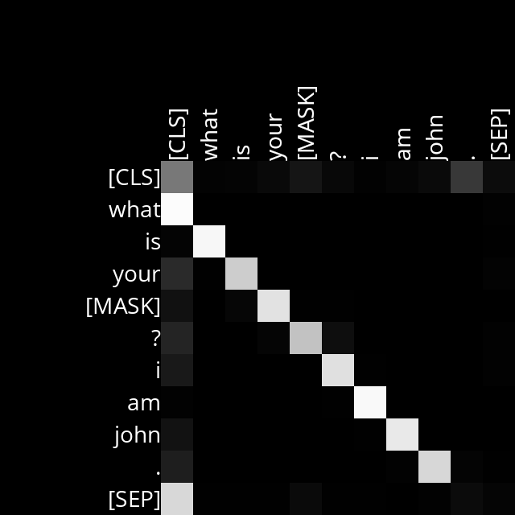
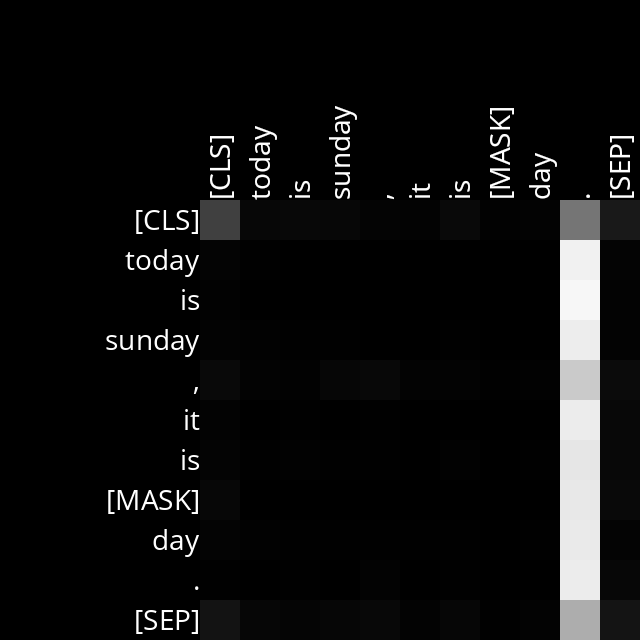

# BERT Attention Visualizer

## Overview
This project implements a Masked Language Model using BERT to predict masked words in a text sequence. It also generates visualizations of attention scores for different attention heads within BERT's transformer architecture. It was developed as part of the CS50’s Introduction to Artificial Intelligence with Python course.


## Getting Started
### Prerequisites
Ensure you have Python 3.12 installed and install the required dependencies:
```bash
pip3 install -r requirements.txt
```

### Running the Model
To predict masked words in a sentence, run:
```bash
python mask.py
```
Example usage:
```bash
$ python mask.py
Text: We turned down a narrow lane and passed through a small [MASK].
We turned down a narrow lane and passed through a small field.
We turned down a narrow lane and passed through a small clearing.
We turned down a narrow lane and passed through a small park.
```

## Understanding the Implementation
### Core Functions
- **get_mask_token_index**: Finds the index of the masked token (`[MASK]`) in the input sequence.
- **get_color_for_attention_score**: Maps an attention score (0-1) to an RGB grayscale color.
- **visualize_attentions**: Generates diagrams of attention weights for each attention head and layer.

## Example Attention Visualizations
#### Layer 3, Head 10 (Attention to Next Word)


#### Layer 4, Head 6 (Attention to Previous Word)


#### Layer 12, Head 1 (Attention to Sentence End)
=

## Analyzing Attention Patterns
By studying attention diagrams, we can infer relationships BERT has learned, such as:
- Heads that focus on word order (before/after relationships).
- Heads that identify punctuation importance.
- Heads that track grammatical structures (e.g., verb-object relationships).

## Notes
- The project is based on the [Hugging Face Transformers](https://huggingface.co/docs/transformers) library.

## License
This project follows the CS50AI curriculum and is for educational purposes.
